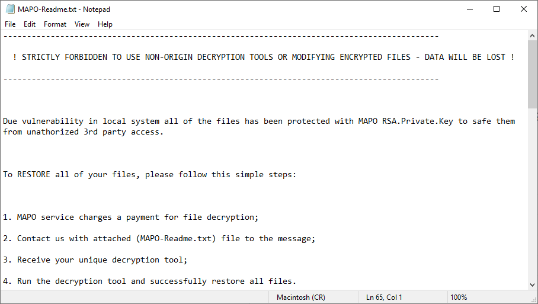
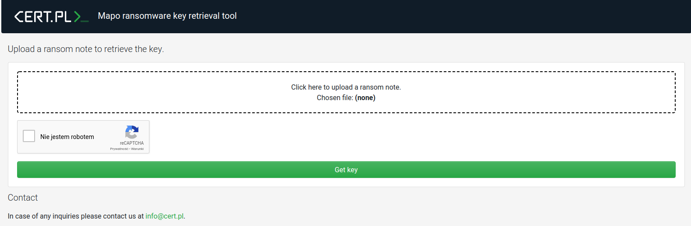
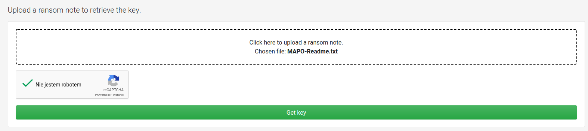
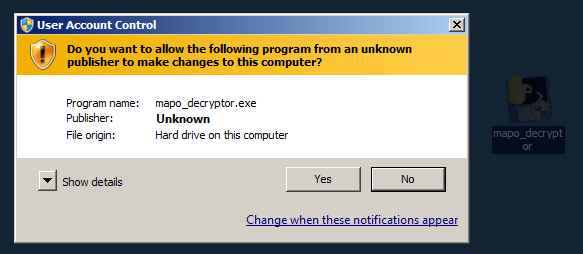
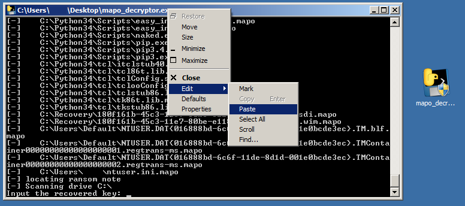

# Mapo ransomware decryption

We are happy to announce that we are releasing a free decryption tool for the Mapo (a GarrantyDecrypt/Outsider variant) ransomware today. We would also like to thank Maciej Kotowicz of Kaspersky’s GReAT for sharing his insights on the ransomware’s encryption process.
Our tool works with encrypted files with the following extensions: `.mapo`, `.deto`, `.mbit`, `.dante`, `.edab`, `.edab1`.

# Detailed instruction

 1. Make sure that the ransomware is no longer running, it can encrypt your files again, rendering the whole decryption process futile.

 2. Download the Mapo Decryptor from https://nomoreransom.cert.pl/static/mapo_decryptor.exe.

 3. Obtain the key from https://mapo.cert.pl:
    1. Upload the ransom note file (the MAPO-Readme.txt file) by clicking on the white field on the website.
    
    2. After choosing the file, the selected filename should be displayed.
    
    _Verify the captcha by clicking on it, then click on “Get key” button to retrieve the key._
    3. If the ransom note is correct and supported by our decryptor, the key will be returned. Don’t close the website just yet. 
 4. Run mapo_decryptor.exe (that you downloaded in step 2.) on the infected computer.
 5. Click **“Yes”** in the UAC Window.
    
 6. Wait until the decryptor asks for the key with the following message “Input the recovered key”.
 7. Decryptor will ask you to provide the key obtained from the service in step 3, copy the key from website and paste it into the terminal as shown below (right click the title bar first):
 
 8. Entering the key and pressing enter will start the decryption process. After the “Press “Enter” to exit…” message, all of your files should be decrypted. 
 9. If something didn’t work, or not all files were decrypted, don’t hesitate to contact us at cert@cert.pl. Please attach log.txt file, that should be generated next to mapo_decryptor.exe. If you can, attach wrongly decrypted file as well.
 10. After decryption and making sure that the files have been decrypted correctly you can safely delete encrypted files. 